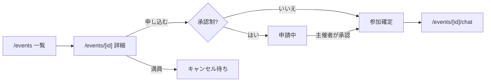
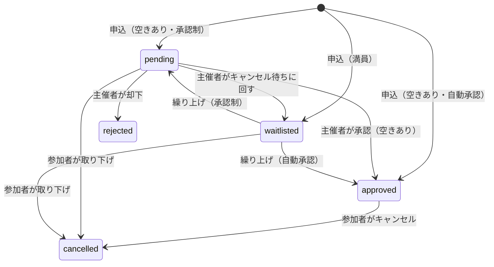

# バドミントン募集アプリ 設計書（初版）

- 位置づけ: 新規開発の設計書。Claude Code に読み込ませて実装する前提
- 参考イメージ: テニスベア（イベントを作って参加者を募る）
- 形態: **Webアプリ**（スマホのブラウザで使うことを主に想定）
- アプリ名: 未定（以下「本アプリ」）

---

## 1. 概要

主催者がバドミントンの練習会・ゲーム会などのイベントを作り、参加者を募る。参加者は一覧から探して申し込む。主催者は申し込みを承認し、参加が決まった人とイベントごとのチャットで連絡を取る。満員のときはキャンセル待ちに並べる。

| 項目 | 内容 |
|---|---|
| 対象 | 体育館の個人開放・サークルの空き枠などで、一緒に打つ人を探したい人 |
| 収益 | 当面なし |
| 決済 | なし。参加費は現地払い（表示のみ） |

## 2. 機能一覧

### 2.1 初版で作る

| 機能 | 内容 |
|---|---|
| ログイン | Google ログイン |
| プロフィール | 表示名・レベル・活動地域・自己紹介 |
| イベント作成・編集・中止 | 日時・場所・レベル・定員・参加費・説明・承認制の有無 |
| イベント一覧 | 開催日順。地域・日付・レベルで絞り込み。過去のイベントは出さない |
| イベント詳細 | 内容、参加確定人数／定員、キャンセル待ち人数、申込ボタン |
| 参加申込 | 申込メッセージ（任意）を添えて申し込む |
| **主催者の承認制** | 承認制のイベントでは、主催者が申し込みを承認／却下する |
| **キャンセル待ち** | 満員のイベントには、キャンセル待ちとして申し込める。空きが出たら順番に繰り上げ |
| **チャット** | イベントごとのグループチャット（主催者＋参加確定者） |
| マイページ | 主催したイベント、参加予定・申請中・キャンセル待ちのイベント、要対応の件数 |

### 2.2 後回しにする

プッシュ通知・メール通知、1対1のメッセージ、レビュー・評価、通報・ブロック、決済、繰り返しイベント、画像アップロード。

## 3. 技術構成

| 分類 | 採用技術 |
|---|---|
| フレームワーク | Next.js（App Router）/ React / TypeScript |
| UI | Tailwind CSS / shadcn/ui |
| 認証・DB | Supabase（Auth: Google / Postgres / Row Level Security） |
| チャットのリアルタイム配信 | Supabase Realtime（`messages` テーブルの INSERT を購読） |
| テスト | Vitest（ロジック）＋ DB関数のテスト（Supabase ローカル環境） |
| ホスティング | Vercel |

- Next.js 16 は学習データと API が異なる箇所がある。実装前に `node_modules/next/dist/docs/` の該当ページを読むこと
- Supabase は `@supabase/ssr` でサーバー／クライアント両方から使う。サービスロールキーはクライアントに出さない
- 無料枠の制限（プロジェクトの一時停止条件など）は Supabase の最新ドキュメントで確認すること

## 4. 画面設計

| パス | 画面 | 備考 |
|---|---|---|
| `/` | トップ | 何ができるかの説明＋直近のイベント |
| `/login` | ログイン | Google ログイン |
| `/events` | イベント一覧 | 絞り込み（地域・日付・レベル） |
| `/events/new` | イベント作成 | ログイン必須 |
| `/events/[id]` | イベント詳細 | 申込・キャンセル・キャンセル待ち |
| `/events/[id]/edit` | イベント編集・中止 | 主催者のみ |
| `/events/[id]/manage` | 申込管理 | 主催者のみ。承認・却下・参加者一覧・キャンセル待ち一覧 |
| `/events/[id]/chat` | イベントチャット | 主催者＋参加確定者のみ |
| `/me` | マイページ | 主催・参加予定・申請中・キャンセル待ち、要対応件数 |
| `/me/profile` | プロフィール編集 | 初回ログイン時はここへ誘導 |



## 5. データ設計（Supabase / Postgres）

```sql
-- プロフィール（auth.users と 1対1）
profiles (
  id uuid primary key references auth.users,
  display_name text not null,
  level text not null,          -- 'beginner' | 'novice' | 'intermediate' | 'advanced'
  area text,                    -- 例: '千葉県船橋市'
  bio text,
  created_at timestamptz default now()
)

events (
  id uuid primary key default gen_random_uuid(),
  host_id uuid not null references profiles,
  title text not null,
  starts_at timestamptz not null,
  ends_at timestamptz not null,
  venue text not null,          -- 体育館名
  area text not null,           -- 絞り込み用（都道府県＋市区町村）
  level_min text, level_max text,
  capacity int not null check (capacity > 0),  -- 主催者を含まない募集人数
  fee int not null default 0,   -- 円・現地払い
  description text,
  requires_approval boolean not null default true,
  status text not null default 'open',  -- 'open' | 'cancelled'
  created_at timestamptz default now()
)

participations (
  id uuid primary key default gen_random_uuid(),
  event_id uuid not null references events,
  user_id uuid not null references profiles,
  status text not null,         -- 'pending' | 'approved' | 'waitlisted' | 'rejected' | 'cancelled'
  message text,                 -- 申込メッセージ
  waitlisted_at timestamptz,    -- キャンセル待ちの順番
  created_at timestamptz default now(),
  updated_at timestamptz default now(),
  unique (event_id, user_id)
)

messages (
  id uuid primary key default gen_random_uuid(),
  event_id uuid not null references events,
  user_id uuid not null references profiles,
  body text not null check (char_length(body) between 1 and 1000),
  created_at timestamptz default now()
)
```

- 「満員」は `status = 'approved'` の件数が `capacity` に達した状態を指す。申請中（pending）は定員に数えない
- 再申込は同じ行の `status` を更新する（`unique (event_id, user_id)` のため）

## 6. 参加ステータスのルール



| 場面 | ルール |
|---|---|
| 申込時 | 満員なら `waitlisted`。空きがあれば、承認制なら `pending`、そうでなければ `approved` |
| 承認時 | 満員なら承認できない（ボタンを無効化し、「キャンセル待ちに回す」を出す） |
| 空きが出たとき（キャンセル・定員増） | `waitlisted_at` が最も古い人を1人ずつ繰り上げる。承認制なら `pending`（主催者の対応待ち）、そうでなければ `approved` |
| 定員を減らすとき | 現在の `approved` 数より小さくはできない |
| イベント中止 | `events.status = 'cancelled'`。申込・チャット投稿を止める（閲覧は可） |
| 開催後 | 申込・キャンセル不可。チャットは閲覧・投稿とも可 |
| 主催者自身 | 申し込めない（参加者に数えない） |

**同時申込で定員を超えないこと。** 申込・承認・キャンセル・繰り上げは、クライアントから `participations` を直接書き換えず、Postgres 関数（`supabase.rpc`）で行う。関数内で対象イベントの行を `select ... for update` でロックしてから件数を数える。

| 関数 | 呼べる人 |
|---|---|
| `apply_to_event(event_id, message)` | ログインユーザー（主催者以外） |
| `cancel_participation(event_id)` | 本人 |
| `decide_participation(participation_id, decision)` — `approve` / `reject` / `waitlist` | 主催者 |
| `promote_waitlist(event_id)` | 上の関数の中から呼ぶ（内部用） |

## 7. 権限（Row Level Security）

| テーブル | 読める人 | 書ける人 |
|---|---|---|
| profiles | ログインユーザー全員 | 本人のみ |
| events | 全員（未ログインも可） | 作成: ログインユーザー / 更新: 主催者のみ |
| participations | 本人と、そのイベントの主催者 | 直接の書き込みは禁止。6章の関数経由のみ |
| messages | 主催者と `approved` の参加者 | 同上の人が、中止されていないイベントにだけ投稿可 |

- イベント詳細に出す人数（参加確定数・キャンセル待ち数）は、件数だけを返すビューか関数で出す（参加者の一覧は主催者と参加確定者にだけ見せる）
- RLS は必ずテストで確かめる（他人の申込を承認できない、参加確定前にチャットが読めない、など）

## 8. チャット

- イベントごとに1部屋。メンバーは主催者＋`approved` の参加者
- 初回表示で直近50件を取得し、以降は Realtime で `event_id` を絞って INSERT を購読する。さらに古いものは「もっと見る」で取得
- 参加をキャンセルした人・却下された人は、以降は読めない
- 既読管理・画像送信・メッセージの編集削除は初版では作らない
- 未読件数の代わりに、マイページで「最新メッセージの時刻」を出す

## 9. 要対応の見せ方（通知の代わり）

通知は後回しにするため、マイページとヘッダーのバッジで知らせる。

- 主催者: 承認待ち（`pending`）の件数
- 参加者: 申請中・キャンセル待ちから状態が変わったもの

## 10. 法令・運用

- 利用規約とプライバシーポリシーを用意する（`/terms`, `/privacy`）。規約に「営利目的の勧誘・出会い目的の利用の禁止」「参加費のやり取りは当事者間で行う」「トラブルに運営は関与しない」を入れる
- 表示名とプロフィールは他の利用者に見える。本名や連絡先を書かないよう入力欄に注記する
- 通報・ブロックは初版では作らないが、問い合わせ先は用意する

## 11. テスト

| 対象 | 確認すること |
|---|---|
| 申込 | 空きあり・承認制 → pending / 空きあり・自動 → approved / 満員 → waitlisted |
| 承認 | 満員のときは承認できない / 主催者以外は承認できない |
| 繰り上げ | キャンセルで先頭の waitlisted が繰り上がる。承認制なら pending になる |
| 同時申込 | 残り1枠に同時に2人が申し込んでも、approved は定員を超えない |
| 定員変更 | 現在の approved 数より小さくできない |
| RLS | 参加確定前のユーザー・却下されたユーザーはチャットを読めない |
| 中止・開催後 | 申込・キャンセルができない |

## 12. 実装の順番

1タスク1コミット。各タスクの完了時に `npm test` と `npm run lint` を通す。

1. プロジェクト作成、Supabase 接続、Google ログイン、プロフィール登録
2. テーブル・RLS・マイグレーション
3. イベント作成・一覧・詳細・編集
4. 申込・キャンセル（自動承認のみ）＋ 同時申込のテスト
5. 承認制（申込管理画面・承認／却下）
6. キャンセル待ちと繰り上げ
7. チャット（Realtime）
8. マイページ・要対応バッジ
9. 利用規約・プライバシーポリシー、Vercel へ公開
